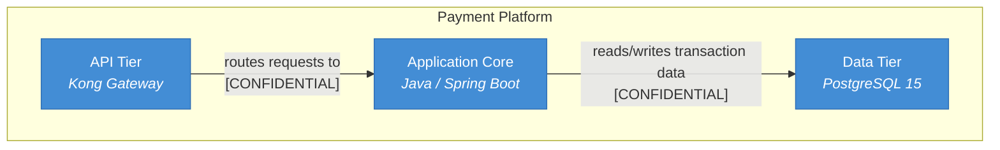

```mermaid
%% Payment Platform — Container Diagram
%% Generated by @diagram-mermaid

graph TB
    subgraph pp ["Payment Platform"]
        API["API Tier<br/><i>Kong Gateway</i>"]:::gateway
        APP["Application Core<br/><i>Java / Spring Boot</i>"]:::app
        DB["Data Tier<br/><i>PostgreSQL 15</i>"]:::database
    end

    API -->|"routes requests to<br/>[CONFIDENTIAL]"| APP
    APP -->|"reads/writes transaction data<br/>[CONFIDENTIAL]"| DB

    classDef gateway fill:#438DD5,stroke:#2E6DB4,color:#fff
    classDef app fill:#438DD5,stroke:#2E6DB4,color:#fff
    classDef database fill:#438DD5,stroke:#2E6DB4,color:#fff
```
