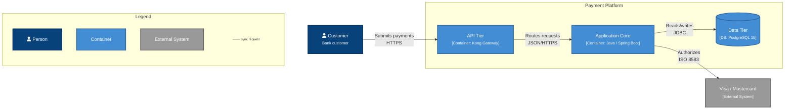

<!-- Payment Processing Platform — Container Diagram -->
<!-- Generated: 2026-04-03T00:00:00Z -->
<!-- Source: examples/payment-platform/diagrams/layout-plan.yaml -->

```mermaid
%%{init: {"flowchart": {"nodeSpacing": 50, "rankSpacing": 80, "curve": "basis", "padding": 24, "wrappingWidth": 200}} }%%
flowchart LR

classDef person fill:#08427b,stroke:#052e56,color:#fff,stroke-width:2px
classDef container fill:#438DD5,stroke:#2E6295,color:#fff,stroke-width:2px
classDef external fill:#999999,stroke:#666666,color:#fff,stroke-width:2px
classDef boundary fill:none,stroke:#666,stroke-width:2px,color:#333
classDef legendText fill:none,stroke:none,color:#333,font-size:11px

customer["fa:fa-user Customer<br/><small>Bank customer</small>"]:::person

subgraph payment_platform["Payment Platform"]
    direction LR
    api_tier["API Tier<br/><small>[Container: Kong Gateway]</small>"]:::container
    app_core["Application Core<br/><small>[Container: Java / Spring Boot]</small>"]:::container
    data_tier[("Data Tier<br/><small>[DB: PostgreSQL 15]</small>")]:::container
end

card_network["Visa / Mastercard<br/><small>[External System]</small>"]:::external

customer -->|"Submits payments<br/>HTTPS"| api_tier
api_tier -->|"Routes requests<br/>JSON/HTTPS"| app_core
app_core -->|"Reads/writes<br/>JDBC"| data_tier
app_core -->|"Authorizes<br/>ISO 8583"| card_network

subgraph Legend[" Legend"]
    direction TB
    leg_person["fa:fa-user Person"]:::person
    leg_container["Container"]:::container
    leg_external["External System"]:::external
    leg_sync["─── Sync request"]:::legendText
end

Legend ~~~ customer
```
