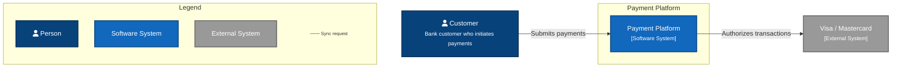

<!-- Payment Processing Platform — System Context Diagram -->
<!-- Generated: 2026-04-03T00:00:00Z -->
<!-- Source: examples/payment-platform/diagrams/layout-plan.yaml -->

```mermaid
%%{init: {"flowchart": {"nodeSpacing": 40, "rankSpacing": 60, "curve": "basis", "padding": 20, "wrappingWidth": 200}} }%%
flowchart LR

classDef person fill:#08427b,stroke:#052e56,color:#fff,stroke-width:2px
classDef system fill:#1168BD,stroke:#0B4884,color:#fff,stroke-width:2px
classDef external fill:#999999,stroke:#666666,color:#fff,stroke-width:2px
classDef boundary fill:none,stroke:#666,stroke-width:2px,color:#333
classDef legendText fill:none,stroke:none,color:#333,font-size:11px

customer["fa:fa-user Customer<br/><small>Bank customer who initiates payments</small>"]:::person

subgraph payment_platform["Payment Platform"]
    direction LR
    pp["Payment Platform<br/><small>[Software System]</small>"]:::system
end

card_network["Visa / Mastercard<br/><small>[External System]</small>"]:::external

customer -->|"Submits payments"| pp
pp -->|"Authorizes transactions"| card_network

subgraph Legend[" Legend"]
    direction TB
    leg_person["fa:fa-user Person"]:::person
    leg_system["Software System"]:::system
    leg_external["External System"]:::external
    leg_sync["─── Sync request"]:::legendText
end

Legend ~~~ customer
```
