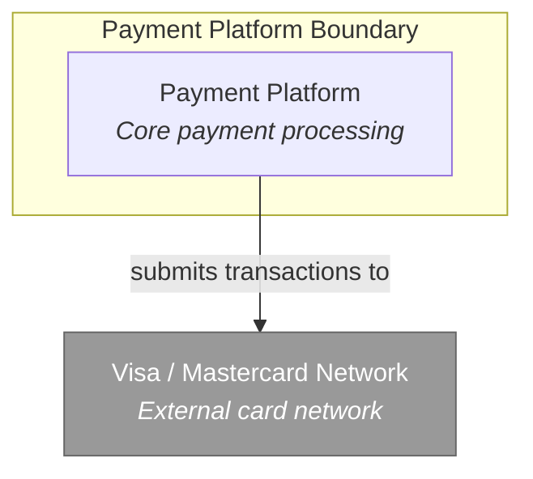

```mermaid
%% Payment Platform — System Context Diagram
%% Generated by @diagram-mermaid

graph TB
    subgraph boundary ["Payment Platform Boundary"]
        PP["Payment Platform<br/><i>Core payment processing</i>"]
    end

    CN["Visa / Mastercard Network<br/><i>External card network</i>"]:::external

    PP -->|"submits transactions to"| CN

    classDef external fill:#999,stroke:#666,color:#fff
```
